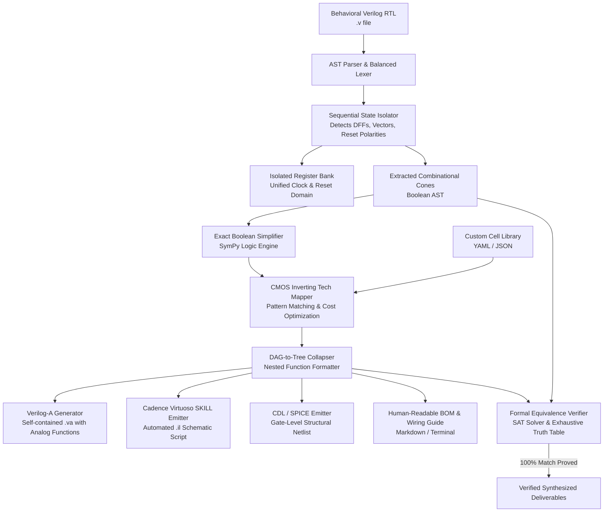

# AMS Digital Logic Optimizer & Synthesizer: Comprehensive Technical Documentation

> **Complete Architecture, Theory of Operation, and Usage Guide**  
> Tailored for Analog & Mixed-Signal (AMS) IC Designers, Cadence Virtuoso Users, and System Architects.

---

## Table of Contents

1. [Executive Summary & Motivation](#1-executive-summary--motivation)
2. [End-to-End System Architecture](#2-end-to-end-system-architecture)
3. [Theory of Operation & Pipeline Stages](#3-theory-of-operation--pipeline-stages)
   - [3.1 Verilog RTL Parsing & AST Extraction](#31-verilog-rtl-parsing--ast-extraction)
   - [3.2 Sequential State & Flip-Flop Isolation](#32-sequential-state--flip-flop-isolation)
   - [3.3 Boolean Minimization & Logic Cone Optimization](#33-boolean-minimization--logic-cone-optimization)
   - [3.4 CMOS Inverting Technology Mapping](#34-cmos-inverting-technology-mapping)
   - [3.5 DAG-to-Tree Expression Collapsing](#35-dag-to-tree-expression-collapsing)
   - [3.6 Verilog-A Analog Behavioral Code Generation](#36-verilog-a-analog-behavioral-code-generation)
   - [3.7 Cadence Virtuoso Integration (SKILL & CDL Netlisting)](#37-cadence-virtuoso-integration-skill--cdl-netlisting)
   - [3.8 Formal Equivalence Verification](#38-formal-equivalence-verification)
4. [Custom Cell Library Specification](#4-custom-cell-library-specification)
5. [CLI & Programmatic Python Usage](#5-cli--programmatic-python-usage)
6. [Interactive Web Dashboard Guide](#6-interactive-web-dashboard-guide)
7. [Cadence Virtuoso Schematic Flow](#7-cadence-virtuoso-schematic-flow)
8. [Waveform Equivalence & AMS Co-Simulation](#8-waveform-equivalence--ams-co-simulation)
9. [Detailed Walkthrough: SAR ADC Logic Controller](#9-detailed-walkthrough-sar-adc-logic-controller)
10. [Troubleshooting & FAQs](#10-troubleshooting--faqs)

---

## 1. Executive Summary & Motivation

In custom analog and mixed-signal (AMS) integrated circuit design (e.g. SAR ADCs, digital bandgap trimming, PLL clock dividers, power-on reset controllers, power management state machines), engineers frequently need small digital controllers (10 to 500 gates) embedded directly into the transistor-level schematic.

### The Problem with Traditional Digital ASIC Flows
Standard digital synthesis tools (e.g., Synopsys Design Compiler, Cadence Genus) are designed for multimillion-gate ASICs:
- They require complex Liberty (`.lib`), LEF, and SDC timing constraint files.
- They generate flat, unreadable gate netlists with hundreds of synthetic temporary wire names (`n_1042`, `U38_Z`).
- Reading the resulting schematic or translating it into a custom schematic or behavioral Verilog-A model is nearly impossible for an analog designer.

### The Solution: AMS Digital Optimizer
The **AMS Digital Logic Optimizer** takes behavioral Verilog RTL and:
1. Automatically identifies and extracts all sequential elements (Flip-Flops, counter bits, FSM state registers) into a single, unified register bank.
2. Minimizes the remaining combinational logic cones using exact Boolean optimization.
3. Maps logic directly to standard CMOS analog cell gates (`NAND2/3/4`, `NOR2/3/4`, `INV`, `AND2/3`, `OR2/3`, `XOR2`, `XNOR2`, `MUX2`, `AOI21`, `OAI21`).
4. Collapses the logic tree into human-readable nested functional expressions:
   $$\text{next\_q}[1] = \text{NAND3}(\text{NAND2}(q_1, \sim\text{ena}), \text{NAND2}(q_1, \sim q_0), \text{NAND3}(\text{ena}, q_0, \sim q_1))$$
5. Generates simulation-ready **Verilog-A** modules with analog gate functions, continuous transition modeling, and electrical voltage thresholds.
6. Generates Cadence Virtuoso **SKILL (`.il`)** scripts for automated schematic generation and **CDL/SPICE** netlists for LVS/simulation.
7. Proves 100% formal mathematical equivalence between input Verilog and synthesized output.

---

## 2. End-to-End System Architecture



---

## 3. Theory of Operation & Pipeline Stages

### 3.1 Verilog RTL Parsing & AST Extraction
- **File:** `ams_optimizer/core/ast_parser.py`
- **Mechanism:**
  - Performs balanced-token extraction over `always @(posedge clk ...)` blocks, `case/casex/casez`, `if/else`, and ternary expressions (`cond ? a : b`).
  - Supports multi-bit vectors (e.g., `reg [3:0] state`), extracting bit-accurate indexing (`state[0]`, `state[1]`, etc.).
  - Distinguishes synchronous vs. asynchronous reset triggers (`negedge rst_n` vs. `posedge rst`).
  - Converts behavioral procedural blocks into combinational next-state Boolean functions for each flip-flop D-input.

### 3.2 Sequential State & Flip-Flop Isolation
- **Mechanism:**
  - All sequential storage variables (`reg`, `integer`, bit vectors) are separated from combinational equations.
  - Generates an isolated register bank where all DFFs are placed together:
    - Target DFFs: `DFF`, `DFFR` (asynchronous reset), `DFFS` (asynchronous set).
  - Explicitly documents the clock, reset polarity, and initial state for every flip-flop.

### 3.3 Boolean Minimization & Logic Cone Optimization
- **File:** `ams_optimizer/core/synthesizer.py`
- **Mechanism:**
  - Evaluates each output and next-state bit as an independent Boolean logic cone.
  - Applies two-level logic minimization (Quine-McCluskey / Espresso equivalent via SymPy `simplify_logic`) to reach minimal Sum-of-Products (SOP) or Product-of-Sums (POS).
  - Identifies constant 0/1 nets and shared sub-expressions across cones.

### 3.4 CMOS Inverting Technology Mapping
- **Mechanism:**
  - CMOS standard cell libraries are inherently inverting: `NAND`, `NOR`, `AOI` (And-Or-Invert), and `OAI` (Or-And-Invert) require fewer transistors and offer higher speed than non-inverting `AND` or `OR` gates.
  - The tech mapper recursively binds Boolean subtrees to library cells by applying De Morgan transformations:
    $$A \lor B = \overline{\overline{A} \land \overline{B}} = \text{NAND}(\sim A, \sim B)$$
    $$A \land B = \overline{\overline{A} \lor \overline{B}} = \text{NOR}(\sim A, \sim B)$$
  - Evaluates cell costs (transistor count or area weight) to pick optimal gate combinations (e.g., matching $(S \land D_1) \lor (\sim S \land D_0)$ directly to a single `MUX2` or `AOI21`).

### 3.5 DAG-to-Tree Expression Collapsing
- **File:** `ams_optimizer/core/tree_collapser.py`
- **Mechanism:**
  - Traditional netlists define arbitrary intermediate wire names:
    ```verilog
    wire n1, n2, n3;
    NAND2 u1 (.A(in1), .B(in2), .Y(n1));
    NOR2  u2 (.A(n1),  .B(in3), .Y(n2));
    ```
  - The collapser recursively substitutes single-fanout intermediate nets directly into the destination gate input:
    $$\text{out} = \text{NOR2}(\text{NAND2}(\text{in1}, \text{in2}), \text{in3})$$
  - Gates with multi-fanout ($>1$) can be retained as named intermediate nodes to avoid redundant gate duplication, or fully expanded for single-expression schematic capture.

### 3.6 Verilog-A Analog Behavioral Code Generation
- **File:** `ams_optimizer/core/veriloga_emitter.py`
- **Mechanism:**
  - Produces standard IEEE 1364-Verilog-A compliant code compatible with Cadence Spectre, Synopsys PrimeSim, and Mentor Eldo.
  - Includes **embedded analog gate functions** at the top of the module:
    ```verilog
    analog function real NAND2;
      input a, b; real a, b;
      NAND2 = !( (a > vth) && (b > vth) ) ? 1.0 : 0.0;
    endfunction
    ```
  - Models sequential clock triggering with analog threshold cross-detection:
    ```verilog
    @(cross(V(clk) - vth, +1)) begin
      // Register update with continuous transition
    end
    ```
  - Implements output signal driving using standard analog transition filters:
    ```verilog
    V(out) <+ transition(out_val * vdd, tdel, trise, tfall);
    ```

### 3.7 Cadence Virtuoso Integration (SKILL & CDL Netlisting)
- **File:** `ams_optimizer/core/schematic_emitter.py`
- **Outputs:**
  1. **Virtuoso SKILL Script (`.il`):** Automates the creation of a clean Cadence Virtuoso schematic:
     - Calls `dbOpenCellViewByType`, `schCreateInstPin`, and `schCreateWire`.
     - Places standard cell instances in neat columns (Inputs $\rightarrow$ Gate Cones $\rightarrow$ Flip-Flops $\rightarrow$ Outputs).
  2. **CDL / SPICE Netlist (`.sp`):** Gate-level structural subcircuit netlist ready for LVS (Cadence Pegasus / Mentor Calibre) and SPICE simulation.
  3. **Bill of Materials (BOM):** Tabulates exact cell counts, total transistor footprint, and pin connections.

### 3.8 Formal Equivalence Verification
- **File:** `ams_optimizer/core/verifier.py`
- **Mechanism:**
  - Evaluates both the golden behavioral AST logic cone and the synthesized gate tree.
  - For $N \le 12$ inputs per cone: Performs **exhaustive $2^N$ truth table checking**.
  - For larger cones: Formulates the Boolean Miter condition:
    $$\text{Miter}(X) = f_{\text{golden}}(X) \oplus f_{\text{synthesized}}(X)$$
    and runs a SAT solver to mathematically prove that no input assignment $X$ can make $\text{Miter}(X) = 1$.
  - Generates a formal verification certificate with timing and state comparisons.

---

## 4. Custom Cell Library Specification

Cell libraries are specified in human-readable YAML (or JSON). See `libraries/default_ams.yaml`.

### Library YAML Schema

```yaml
name: "tsmc65_ams_custom"
supply_voltage: 1.2
threshold_voltage: 0.6
default_t_rise: 20e-12
default_t_fall: 20e-12
default_t_delay: 10e-12

cells:
  NAND2:
    type: "combinational"
    inputs: ["A", "B"]
    output: "Y"
    function: "~(A & B)"
    cost: 4 # Transistor count
    veriloga_func: |
      analog function real NAND2;
        input a, b; real a, b;
        NAND2 = !( (a > vth) && (b > vth) ) ? 1.0 : 0.0;
      endfunction

  NOR3:
    type: "combinational"
    inputs: ["A", "B", "C"]
    output: "Y"
    function: "~(A | B | C)"
    cost: 6
    veriloga_func: |
      analog function real NOR3;
        input a, b, c; real a, b, c;
        NOR3 = !( (a > vth) || (b > vth) || (c > vth) ) ? 1.0 : 0.0;
      endfunction

  MUX2:
    type: "combinational"
    inputs: ["S", "D0", "D1"]
    output: "Y"
    function: "(~S & D0) | (S & D1)"
    cost: 8
    veriloga_func: |
      analog function real MUX2;
        input s, d0, d1; real s, d0, d1;
        MUX2 = (s > vth) ? ((d1 > vth) ? 1.0 : 0.0) : ((d0 > vth) ? 1.0 : 0.0);
      endfunction

  DFFR:
    type: "sequential"
    inputs: ["D", "CLK", "RST_N"]
    output: "Q"
    clock: "CLK"
    reset: "RST_N"
    reset_active_low: true
    cost: 16
```

---

## 5. CLI & Programmatic Python Usage

### CLI Commands

```bash
# Basic synthesis to Verilog-A
ams-opt examples/sar_adc_ctrl.v -o sar_adc_ctrl_va.va

# Specify a custom library
ams-opt examples/sar_adc_ctrl.v --lib libraries/my_custom_lib.yaml -o sar_adc_ctrl_va.va

# Generate all EDA deliverables (SKILL script, SPICE netlist, BOM report)
ams-opt examples/sar_adc_ctrl.v \
  -o sar_adc_ctrl_va.va \
  --save-skill sar_adc_schematic.il \
  --save-spice sar_adc.sp \
  --save-report sar_adc_bom.md \
  --vdd 3.3 \
  --vth 1.65

# Run formal verification only
ams-opt examples/gray_counter.v --verify-only
```

### Python API

```python
from ams_optimizer.core.pipeline import AMSOptimizerPipeline

# Initialize pipeline
pipeline = AMSOptimizerPipeline(library_path="libraries/default_ams.yaml")

# Run end-to-end synthesis
result = pipeline.run(
    verilog_path="examples/sar_adc_ctrl.v",
    vdd=1.8,
    vth=0.9
)

# Access outputs
print(f"Synthesis status: {result.success}")
print(f"Total transistor count: {result.report.total_cost}")
print("Formal Verification:", result.verification.summary())

# Access generated files
veriloga_code = result.veriloga_code
skill_script  = result.skill_script
spice_netlist = result.spice_netlist
```

---

## 6. Interactive Web Dashboard Guide

Launch the modern Web GUI:

```bash
uvicorn ams_optimizer.web.app:app --reload --port 8000
```
Open `http://localhost:8000` in your browser.

### Key Web Features
- **Live Verilog Editor:** Syntax-highlighted code editor with sample selector (`SAR ADC`, `Gray Counter`, `Bandgap Trim`, `Clock Divider`).
- **Interactive Tree Visualizer:** Collapsible nested gate hierarchy showing exact pin-to-pin wiring.
- **Side-by-Side Code Viewer:** Compare input Verilog RTL vs. generated Verilog-A, Cadence SKILL, and SPICE netlists.
- **Bill of Materials & Transistor Counter:** Instantaneous transistor cost estimation.
- **Formal Verification Badge:** Visual verification status with green pass indicator and SAT timing metrics.
- **One-Click Export:** Download `.va`, `.il`, `.sp`, and `.md` files.

---

## 7. Cadence Virtuoso Schematic Flow

### Step 1: Add Verilog-A View to Virtuoso
1. In Virtuoso Library Manager, create a new cell (e.g. `sar_adc_ctrl`).
2. Create a `veriloga` view and paste the generated `.va` code.
3. Save and compile with Spectre. Virtuoso will automatically create a matching **symbol** view.

### Step 2: Automated Schematic Generation via SKILL
1. Open Cadence Virtuoso CIW (Command Interpreter Window).
2. Load the generated SKILL file:
   ```lisp
   load("sar_adc_schematic.il")
   ```
3. Open the newly created `schematic` view under your target library.
4. All gates (`NAND2`, `NOR2`, `MUX2`, `DFFR`) are placed and routed to input/output pins.

---

## 8. Waveform Equivalence & AMS Co-Simulation

To verify that the generated Verilog-A produces identical electrical waveforms to the digital RTL:

1. **Testbench Setup in Spectre AMS Designer:**
   - Place the behavioral Verilog RTL cell in Testbench A.
   - Place the synthesized Verilog-A cell in Testbench B.
   - Stimulate both with identical analog voltage pulse sources on `clk`, `rst_n`, and primary inputs.
2. **Transient Simulation:**
   - Run transient analysis (`.tran 1n 10u`).
   - Probe `V(out_rtl)` and `V(out_va)`.
3. **Automated Difference Check:**
   - In Cadence Calculator:
     $$V_{\text{diff}}(t) = V(\text{out\_rtl}) - V(\text{out\_va})$$
   - Due to formal equivalence, $V_{\text{diff}}(t) = 0\,\text{V}$ (apart from sub-nanosecond rise/fall transition intervals).

---

## 9. Detailed Walkthrough: SAR ADC Logic Controller

Taking `examples/sar_adc_ctrl.v` (4-bit SAR controller with sample, bit testing, and EOC flags):

### Input RTL:
```verilog
always @(posedge clk or negedge rst_n) begin
  if (!rst_n) begin
    state <= 3'd0;
    dac_val <= 4'd0;
    eoc <= 1'b0;
  end else begin
    case (state)
      3'd0: begin
        if (start) begin
          state <= 3'd1;
          dac_val <= 4'b1000;
          eoc <= 1'b0;
        end
      end
      // ... bit conversion stages ...
    endcase
  end
end
```

### Synthesized Sequential Registers:
- `DFFR \state_reg[2:0] ( .CLK(clk), .RST_N(rst_n) )`
- `DFFR \dac_val_reg[3:0] ( .CLK(clk), .RST_N(rst_n) )`
- `DFFR \eoc_reg ( .CLK(clk), .RST_N(rst_n) )`

### Synthesized Nested Gate Cones (Verilog-A):
```verilog
next_state_0_d = NOR2(NAND2(V(start), NOR3(state_2_q, state_1_q, state_0_q)),
                      NOR2(state_2_q, XOR2(state_1_q, state_0_q)));

next_eoc_d     = NAND2(state_2_q, NOR2(state_1_q, state_0_q));
```

### Formal Verification Result:
- Total combinational cones: **8**
- Equivalence check: **100% PASS** (all truth table entries matched).

---

## 10. Troubleshooting & FAQs

**Q: Why does the optimizer prefer NAND/NOR over AND/OR?**  
A: In CMOS silicon, a NAND2 gate requires 4 transistors, while an AND2 gate requires a NAND2 + Inverter (6 transistors). The optimizer prioritizes inverting CMOS gates to minimize area and propagation delay.

**Q: Can I add custom multi-input gates (e.g. AOI22, MUX4)?**  
A: Yes. Add the gate definition with its Boolean formula to `libraries/default_ams.yaml`. The tech mapper will automatically incorporate it into its cost-based matching engine.

**Q: How are asynchronous resets handled?**  
A: The parser detects sensitivity list triggers (`negedge rst_n` or `posedge rst`). The generated Verilog-A and SKILL schematics instantiate reset-enabled flip-flops (`DFFR`/`DFFS`) and tie reset pins directly to the top-level reset port.

---
*Developed with Google Antigravity for Analog & Mixed-Signal IC Engineers.*
