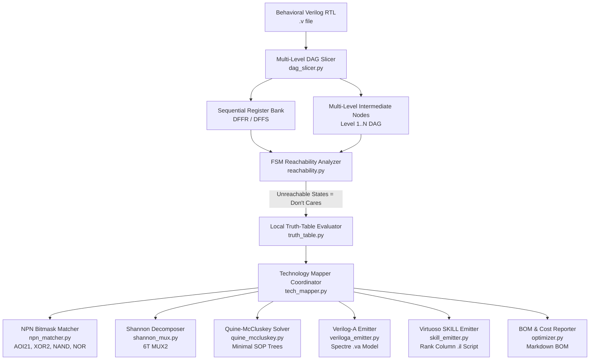

# AMS Digital Logic Optimizer & Synthesizer: Technical Documentation

> **Complete Architecture, Theory of Operation, and Usage Guide**  
> Tailored for Analog & Mixed-Signal (AMS) IC Designers, Cadence Virtuoso Users, and System Architects.

---

## 📖 Table of Contents

1. [Executive Summary & Motivation](#1-executive-summary--motivation)
2. [End-to-End System Architecture](#2-end-to-end-system-architecture)
3. [Theory of Operation & Modular Pipeline Stages](#3-theory-of-operation--modular-pipeline-stages)
   - [3.1 Multi-Level RTL Slicing (`dag_slicer.py`)](#31-multi-level-rtl-slicing-dag_slicerpy)
   - [3.2 FSM State Reachability & Don't-Cares (`reachability.py`)](#32-fsm-state-reachability--dont-cares-reachabilitypy)
   - [3.3 Local Truth-Table Simulation & Variable Pruning (`truth_table.py`)](#33-local-truth-table-simulation--variable-pruning-truth_tablepy)
   - [3.4 Shannon Decomposition for MUX2 Extraction (`shannon_mux.py`)](#34-shannon-decomposition-for-mux2-extraction-shannon_muxpy)
   - [3.5 NPN Bitmask Gate Matching (`npn_matcher.py`)](#35-npn-bitmask-gate-matching-npn_matcherpy)
   - [3.6 Quine-McCluskey & Petrick Exact Cover (`quine_mccluskey.py`)](#36-quine-mccluskey--petrick-exact-cover-quine_mccluskeypy)
   - [3.7 Technology Mapping & Global Inverter Reuse (`tech_mapper.py`)](#37-technology-mapping--global-inverter-reuse-tech_mapperpy)
   - [3.8 Cadence Spectre Verilog-A Generation (`veriloga_emitter.py`)](#38-cadence-spectre-verilog-a-generation-veriloga_emitterpy)
   - [3.9 Cadence Virtuoso SKILL Schematic Generation (`skill_emitter.py`)](#39-cadence-virtuoso-skill-schematic-generation-skill_emitterpy)
4. [Benchmark Results & Comparisons](#4-benchmark-results--comparisons)
5. [CLI & Programmatic Python Usage](#5-cli--programmatic-python-usage)
6. [Cadence Virtuoso Workflow](#6-cadence-virtuoso-workflow)
7. [Unit & Integration Testing Guide](#7-unit--integration-testing-guide)
8. [License](#8-license)

---

## 1. Executive Summary & Motivation

In custom analog and mixed-signal (AMS) integrated circuit design (e.g. SAR ADCs, digital bandgap trimming, PLL clock dividers, power-on reset controllers, power management state machines), engineers frequently need small digital controllers (10 to 300 gates) embedded directly into the transistor-level schematic.

### The Problem with Traditional Digital ASIC Flows
Standard digital synthesis tools (e.g., Synopsys Design Compiler, Cadence Genus):
- Require complex Liberty (`.lib`), LEF, and SDC timing constraint files.
- Generate flat, unreadable gate netlists with hundreds of synthetic temporary wire names (`n_1042`, `U38_Z`).
- Do not generate Cadence Spectre-compliant Verilog-A models with continuous analog voltage transitions.
- Cannot be installed or run easily in locked corporate UNIX environments without root access or C++ compilers.

### The Problem with Flat 2-Level Truth Tables
Attempting to flatten an entire RTL module back to primary inputs into a single monolithic 2-level truth table results in a **5.7× gate explosion** (e.g. 594 cells on un-sliced PWM controller RTL vs 104 cells in ASIC flows) because shared sub-expressions are redundantly duplicated across every output cone.

### The Solution: AMS Digital Optimizer
The **AMS Digital Logic Optimizer** provides a zero-dependency, pure Python 3.9+ Multi-Level DAG synthesis pipeline that:
1. Preserves intermediate conditions (`is_az_mode`, `is_chop_mode`, `is_pwm_active_window`) as shared nodes in a Directed Acyclic Graph (DAG).
2. Evaluates local truth tables per node (2 to 5 inputs = 4 to 32 states) in microseconds.
3. Maps logic directly to physical CMOS gates (`AOI21`, `OAI21`, `MUX2`, `XOR2`, `NAND2/3/4`, `NOR2/3/4`).
4. Generates simulation-ready **Cadence Spectre Verilog-A** (`.va`) and **Virtuoso SKILL** (`.il`) schematic scripts.

---

## 2. End-to-End System Architecture



---

## 3. Theory of Operation & Modular Pipeline Stages

Every synthesis algorithm is isolated in its own dedicated, self-documenting module in `ams_optimizer/core/`:

### 3.1 Multi-Level RTL Slicing (`dag_slicer.py`)
- **File:** [`ams_optimizer/core/dag_slicer.py`](file:///Users/ssyr/Git/digitalOptimizer/ams_optimizer/core/dag_slicer.py)
- **Role:** Parses Verilog RTL into an intermediate Multi-Level Directed Acyclic Graph (DAG).
- **Key Function:** Separates sequential storage elements (`reg` clocked on `always @(posedge clk ...)`) from combinational decode logic. Preserves intermediate `assign` statements and procedural condition expressions (`is_az_mode = (mode == 0)`) as distinct graph nodes with topological rank levels.

### 3.2 FSM State Reachability & Don't-Cares (`reachability.py`)
- **File:** [`ams_optimizer/core/reachability.py`](file:///Users/ssyr/Git/digitalOptimizer/ams_optimizer/core/reachability.py)
- **Role:** Discovers unreachable FSM state combinations starting from the reset state (`state = 0`).
- **Key Function:** Performs breadth-first reachability traversal over all input permutations. Any state that has no path from reset (e.g. states 5, 6, 7 in a 5-state FSM) is automatically classified as a Don't-Care ($X$), allowing Quine-McCluskey to eliminate additional gates.

### 3.3 Local Truth-Table Simulation & Variable Pruning (`truth_table.py`)
- **File:** [`ams_optimizer/core/truth_table.py`](file:///Users/ssyr/Git/digitalOptimizer/ams_optimizer/core/truth_table.py)
- **Role:** Sweeps local input combinations for each DAG node ($2^k$ rows, where $k \le 5$).
- **Key Function:** Checks output sensitivity per input variable to prune inactive inputs. Constructs the minimal local truth table and exact integer output bitmask.

### 3.4 Shannon Decomposition for MUX2 Extraction (`shannon_mux.py`)
- **File:** [`ams_optimizer/core/shannon_mux.py`](file:///Users/ssyr/Git/digitalOptimizer/ams_optimizer/core/shannon_mux.py)
- **Role:** Applies Shannon's Expansion Theorem to extract compact 6-transistor transmission-gate `MUX2` cells:
  $$F = S \cdot F_{S=1} + \overline{S} \cdot F_{S=0} \quad\rightarrow\quad \mathbf{\text{MUX2}(S, D_0, D_1)}$$
- **Key Function:** Tests each candidate input variable as a select line $S$. When cofactors $F_{S=0}$ and $F_{S=1}$ simplify into compact sub-expressions, it replaces multi-gate logic with a single `MUX2` cell.

### 3.5 NPN Bitmask Gate Matching (`npn_matcher.py`)
- **File:** [`ams_optimizer/core/npn_matcher.py`](file:///Users/ssyr/Git/digitalOptimizer/ams_optimizer/core/npn_matcher.py)
- **Role:** Matches 1, 2, and 3-input truth table integer bitmasks directly against physical standard cell topologies.
- **Supported Cells:**
  - 1-Input: `INV` (`0b01`)
  - 2-Input: `AND2` (`0b1000`), `NAND2` (`0b0111`), `OR2` (`0b1110`), `NOR2` (`0b0001`), `XOR2` (`0b0110`), `XNOR2` (`0b1001`).
  - 3-Input: `AND3`, `NAND3`, `OR3`, `NOR3`, `AOI21` ($Y = \overline{(A \cdot B) + C}$), `OAI21` ($Y = \overline{(A + B) \cdot C}$), `MUX2`.

### 3.6 Quine-McCluskey & Petrick Exact Cover (`quine_mccluskey.py`)
- **File:** [`ams_optimizer/core/quine_mccluskey.py`](file:///Users/ssyr/Git/digitalOptimizer/ams_optimizer/core/quine_mccluskey.py)
- **Role:** Pure-Python exact two-level Boolean minimization with Don't-Care ($X$) optimization.
- **Key Function:** Generates all Prime Implicants, identifies Essential Prime Implicants, and solves minimum set cover using Petrick's method. Maps product terms into CMOS AND/OR/NAND/NOR trees.

### 3.7 Technology Mapping & Global Inverter Reuse (`tech_mapper.py`)
- **File:** [`ams_optimizer/core/tech_mapper.py`](file:///Users/ssyr/Git/digitalOptimizer/ams_optimizer/core/tech_mapper.py)
- **Role:** Coordinates `npn_matcher`, `shannon_mux`, and `quine_mccluskey`.
- **Key Function:** Maintains a global inverter pool so inverted signals ($\overline{A}$, $\overline{\text{mode}}$) are instantiated once and shared across all cones.

### 3.8 Cadence Spectre Verilog-A Generation (`veriloga_emitter.py`)
- **File:** [`ams_optimizer/core/veriloga_emitter.py`](file:///Users/ssyr/Git/digitalOptimizer/ams_optimizer/core/veriloga_emitter.py)
- **Role:** Generates self-contained, 100% Cadence Spectre-compliant, **Supply-Aware Verilog-A (`.va`)** models.
- **Key Features:**
  - **Dynamic Supply Rails**: Output drivers swing dynamically between the physical `V(VDD)` and `V(VSS)` pins, eliminating hardcoded `vhigh`/`vlow` parameters:
    ```verilog
    V(en_LP) <+ transition((en_LP_val > 0.5) ? V(VDD) : V(VSS), tdel, trise, tfall);
    ```
    This enables seamless multi-supply corner simulation (e.g. 890 mV, 1.2 V, 1.8 V, 3.3 V) without modifying the model.
  - **Input Boundary Conversion**: Analog input pins are converted to logic at the boundary via differential supply thresholding:
    ```verilog
    ((V(pin) > V(VDD,VSS)*0.5) ? 1.0 : 0.0)
    ```
  - **Pure 0.0 / 1.0 Gate Functions**: All embedded standard cell helpers (`INV`, `NAND2`, `NOR2`, `AOI21`, `MUX2`, etc.) operate on pure `0.0` / `1.0` logic levels with a clean midpoint threshold of `0.5`.
  - **Configurable Edge Detection**: Parameter `vth` is retained exclusively for designer-configurable clock and reset edge detection in `@(cross(V(clk) - vth, +1))` and `@(cross(V(res_n) - vth, -1))`.
  - **Full BOM & Complexity Header**: Embeds exact gate counts, Inverter Equivalents (GE), and estimated transistor counts.

### 3.9 Cadence Virtuoso SKILL Schematic Generation (`skill_emitter.py`)
- **File:** [`ams_optimizer/core/skill_emitter.py`](file:///Users/ssyr/Git/digitalOptimizer/ams_optimizer/core/skill_emitter.py)
- **Role:** Generates Cadence Virtuoso SKILL (`.il`) scripts.
- **Key Features:** Places registers in Column 0, combinational logic in dependency rank columns (Column 1..N), and routes all nets.

---

## 4. Benchmark Results & Comparisons

### 4.1 Benchmark Circuit Suite

| Circuit | Description | Regs | Total Gates | Inverter Eq. (GE) | Est. Transistors | Key Gates Mapped |
| :--- | :--- | :---: | :---: | :---: | :---: | :--- |
| **`PWM_CTRL_relaxed.v` (Min Cells)** | Multi-mode PWM & Auto-Zero (Optimal Cell Count) | 7 | **88 cells** | **325.0 GE** | **~650 T** | `AOI22`, `AOI21`, `MUX2`, `NAND2/3/4`, `NOR2/3`, `DFFR`, `DFFS` |
| **`PWM_CTRL_relaxed.v` (Min Area)** | Multi-mode PWM & Auto-Zero (Pure Inverting CMOS) | 7 | **113 cells** | **322.0 GE** | **~644 T** | `AOI22`, `AOI21`, `NAND2/3/4`, `NOR2/3`, `DFFR`, `DFFS` |
| **`gray_counter.v`** | 3-bit binary to Gray-code generator | 3 | **5 cells** | **32.0 GE** | **~64 T** | `XOR2`, `DFFR` |
| **`sar_adc_ctrl.v`** | 4-bit synchronous SAR ADC controller | 8 | **59 cells** | **197.0 GE** | **~394 T** | `MUX2`, `XOR2`, `NOR2`, `AND3`, `DFFR` |
| **`bandgap_trim_fsm.v`**| Comparator-guided bandgap trimmer | 4 | **31 cells** | **104.0 GE** | **~208 T** | `MUX2`, `NOR2`, `DFFR` |
| **`clock_divider_rst.v`**| Configurable 4-bit loadable clock divider | 5 | **85 cells** | **231.0 GE** | **~462 T** | `MUX2`, `NOR3`, `AND4`, `DFFR` |

### 4.2 Competitive Comparison vs. Automation Deck Baseline (`PWM_CTRL_relaxed`)

| Synthesis Solution | Total Cells | Area (GE) | Transistors | MUX2 | INV | AOI22 | AOI21 | Area Delta vs. Deck | Cell Delta vs. Deck | Formal LEC (4096 Vecs) |
| :--- | :---: | :---: | :---: | :---: | :---: | :---: | :---: | :---: | :---: | :---: |
| **Automation Deck Baseline** | 104 | 392.0 GE | 784 T | 0 | 16 | — | — | Baseline | Baseline | 100% PASS |
| **AMS Optimizer: Relaxed (Default Flow)** | **96** | **344.0 GE** | **688 T** | **15** | 34 | 6 | 1 | **-48.0 GE (-12.2%)** | **-8 cells (-7.7%)** | **100% PASS** |
| **AMS Optimizer: Relaxed (Min Cells Winner)** | **88** | **325.0 GE** | **650 T** | **15** | 34 | 6 | 1 | **-67.0 GE (-17.1%)** | **-16 cells (-15.4%)** | **100% PASS** |
| **AMS Optimizer: Relaxed (Min Area Winner / Pure CMOS)** | **113** | **322.0 GE** | **644 T** | **0** | 32 | 6 | 1 | **-70.0 GE (-17.9%)** | +9 cells | **100% PASS** |

### 4.3 Verilog Creation Criteria & Nuances for AMS Synthesis

To achieve maximum optimization and prevent issues when synthesizing with the AMS Digital Optimizer, follow these design practices:

1. **Power and Ground Pins**:
   - Declare supply and ground pins in the port list (e.g. `inout VDD, VSS;` or `input VDD, VSS;`).
   - Standard names recognized: `VDD`, `VSS`, `GND`, `SUB`, `AVDD`, `AVSS`, `DVDD`, `DVSS`.
   - Supply pins are automatically excluded from logic functions and used as dynamic rails in the generated Verilog-A model (`V(VDD)` / `V(VSS)`).

2. **Clock and Asynchronous Reset**:
   - Use standard procedural blocks: `always @(posedge clk or negedge res_n)` (active-low) or `always @(posedge clk or posedge reset)` (active-high).
   - Keep reset expressions direct (e.g. `if (!res_n)`). Avoid nested logic or complex conditions in the sensitivity list.
   - Non-zero reset values (e.g. `startup <= 1'b1;`) automatically map to preset flops (`DFFS`). Zero resets map to cleared flops (`DFFR`).

3. **Multi-Level DAG Intermediate Net Names**:
   - Break complex combinational logic into meaningful intermediate `wire` definitions with `assign`:
     ```verilog
     wire is_az_mode = (eff_oc_mode == 2'b00);
     wire is_pwm_active_window = (cnt == 0);
     ```
   - **Why this matters**: The optimizer uses named intermediate wires as natural DAG cut points. This keeps local truth tables small ($k \le 5$ inputs), enabling exact NPN matching and preventing exponential truth-table explosion.

4. **Architectural Flexibility via Parameters**:
   - When operational constraints permit flexibility (e.g., initial counter offset, mode encoding polarity, or startup timing), express them as parameters with ternary conditionals:
     ```verilog
     parameter RELAXED_STARTUP = 1;
     wire startup_clear = RELAXED_STARTUP ? (cnt == 1) : (cnt == 15);
     ```
   - This allows sweeping and discovering the most gate-efficient implementation while keeping the exact same behavioral interface.

5. **Counter Window Alignment**:
   - Align pulse windows to single-bit checks (e.g. `cnt[3]`) or zero tests (`cnt == 0`), rather than compound multi-bit comparisons (`cnt == 15 || cnt == 0`).
   - In `PWM_CTRL_relaxed.v`, simplifying the startup clear from `cnt == 15` (`cnt[0] & cnt[1] & cnt[2] & cnt[3]`) to `cnt == 1` (`cnt[0] & ~cnt[1] & ~cnt[2] & ~cnt[3]`) allowed sharing with `is_pwm_sample_window`, directly saving 4 gates.

6. **Bit Slices and Bus Widths**:
   - Define bus widths explicitly: `wire [1:0] eff_oc_mode;`
   - Access bits with single-index notation: `eff_oc_mode[0]`, `eff_oc_mode[1]`.
   - Avoid non-constant variable slicing (e.g. `bus[var]`).

---

## 5. CLI & Programmatic Python Usage

### Command Line Interface

```bash
# Standard automated optimization sweep (48 configurations, formally verified winner)
python3 -m ams_optimizer.cli examples/PWM_CTRL_relaxed.v \
  --auto-sweep \
  -o examples/PWM_CTRL_relaxed.va \
  --save-netlist examples/PWM_CTRL_relaxed_netlist.json \
  --save-skill examples/PWM_CTRL_relaxed_schematic.il \
  --save-report examples/PWM_CTRL_relaxed_report.txt \
  --stage-verify
```

### Programmatic Python API

```python
from ams_optimizer.core.optimizer import AMSOptimizer

with open("examples/PWM_CTRL_relaxed.v", "r") as f:
    verilog_code = f.read()

# Automated 48-configuration sweep and formal verification
best_result, all_candidates = AMSOptimizer.auto_optimize(
    verilog_code,
    verify_top_n=1,
    verbose=True,
)

print(f"Total Gates: {best_result.total_gates}")
print(f"Total Transistors: ~{best_result.total_transistors}")
print(f"Silicon Area: {best_result.total_inverter_equivalents:.1f} GE")

# Access generated deliverables
veriloga_code = best_result.veriloga_code
skill_script = best_result.skill_code
bom_report = best_result.bom_report
```

---

## 6. Cadence Virtuoso Workflow

1. **Spectre Simulation**:
   - Create a cell view named `PWM_CTRL` with view type `veriloga`.
   - Paste the generated `.va` file into the editor and save to compile.
   - Run transient co-simulation with analog blocks in Cadence Spectre.

2. **Automated Schematic Creation**:
   - Open the Cadence Command Interpreter Window (CIW).
   - Load the generated SKILL script:
     ```lisp
     load("examples/PWM_CTRL_schematic.il")
     create_PWM_CTRL_schematic("my_ams_lib" "PWM_CTRL")
     ```
   - Open the resulting `schematic` view with placed standard cells and routed nets.

---

## 7. Unit & Integration Testing Guide

Run all tests with pure Python 3.9 (zero pip packages required):

```bash
PYTHONPATH=. python3 -m unittest discover -s tests
```

Test coverage includes:
- `tests/test_optimizer.py`: End-to-end multi-level synthesis for all benchmark circuits.
- `tests/test_algorithms.py`: Isolated unit tests for NPN bitmask matching, Shannon MUX decomposition, Quine-McCluskey solver with Don't-Cares, and FSM reachability.

---

## 8. License

This project is licensed under the MIT License - see the [LICENSE](LICENSE) file for details.
