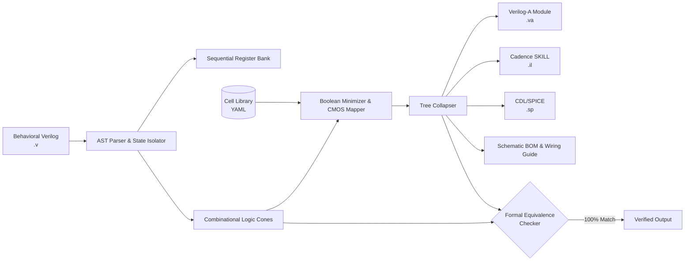

# AMS Digital Logic Optimizer & Synthesizer

<p align="center">
  
  
  
  
  
  
</p>

> **A specialized synthesis, logic minimization, and code generation engine for Analog and Mixed-Signal (AMS) IC blocks.**  
> Transforms behavioral Verilog RTL into isolated Flip-Flops, simplified combinational CMOS gates (`NAND`, `NOR`, `MUX`, `AOI`), and simulation-ready Cadence Spectre **Verilog-A** models.

---

## 📂 Repository Structure & Engines

The repository provides two distinct synthesis pipelines:

1. **`v2_sim_truth_table/` (Simulation-Driven Truth Table Engine - Recommended for Python 3.9 & zero-pip environments)**
   - **Zero External Dependencies**: Runs entirely on stock Python 3.9+ standard library (`argparse`, `itertools`, `dataclasses`, `re`).
   - **Exhaustive Simulation**: Slices RTL into pseudo-inputs $(X, Q)$ and outputs $(D, Y)$, compiles RTL to Python, and simulates all $2^N$ states.
   - **Truth-Table Minimization**: Pure-Python Quine-McCluskey + Petrick's exact set cover with active support-set pruning.
   - **Spectre Verilog-A Emitter**: Generates 100% Cadence Spectre-compliant Verilog-A with `analog begin`, `@(initial_step)`, `@(cross)` clock sampling, and transition contributions for all outputs.

2. **`v1_ast_pipeline/` (AST & Symbolic Pipeline with Web GUI & Virtuoso SKILL)**
   - **Symbolic Parser & Logic Simplification**: Uses SymPy and AST tree manipulation.
   - **Cadence Virtuoso Automation**: Emits SKILL scripts (`.il`), CDL/SPICE netlists, and SAT formal verification.
   - **Web Dashboard**: Interactive FastAPI + HTML5 GUI for live browser editing.

---

## 📖 Table of Contents
- [Quick Start: v2 Simulation-Driven Engine (Zero-Pip)](#-quick-start-v2-simulation-driven-engine-zero-pip)
- [Quick Start: v1 AST & Full GUI Pipeline](#-quick-start-v1-ast--full-gui-pipeline)
- [Why AMS Digital Optimizer?](#-why-ams-digital-optimizer)
- [Architecture & Pipeline](#-architecture--pipeline)
- [Cadence Virtuoso & Spectre Workflow](#-cadence-virtuoso--spectre-workflow)
- [Running Tests](#-running-tests)
- [License](#-license)


---

## 💡 Why AMS Digital Optimizer?

In custom analog and mixed-signal IC design (e.g. SAR ADCs, digital bandgap trimming, PLL clock dividers, power-on reset state machines), engineers frequently need small digital controllers (10 to 500 gates) embedded directly into the transistor-level schematic.

Standard digital synthesis tools (Synopsys DC, Cadence Genus):
- Require heavy digital infrastructure (`.lib`, `.lef`, SDC constraints).
- Generate flat, unreadable netlists with hundreds of synthetic temporary nets (`n_1042`, `U38_Z`).
- Make manual schematic entry or Verilog-A modeling painful and error-prone.

**AMS Digital Optimizer** transforms RTL directly into:
1. **Isolated Register Bank**: All Flip-Flops (`DFFR`, counter registers, FSM state bits) in one unified location.
2. **Simplified Combinational CMOS Gates**: Optimized using exact Boolean reduction and mapped to standard CMOS inverting gates (`NAND2/3/4`, `NOR2/3/4`, `MUX2`, `AOI21`, `OAI21`).
3. **Readable Nested Expressions**:
   $$\text{next\_q}[1] = \text{NAND3}(\text{NAND2}(q_1, \sim\text{ena}), \text{NAND2}(q_1, \sim q_0), \text{NAND3}(\text{ena}, q_0, \sim q_1))$$
4. **Self-Contained Verilog-A Views**: Simulation-ready `.va` modules with analog gate functions, threshold cross-detection (`@(cross(V(clk) - vth, +1))`), and electrical voltage transitions.
5. **Cadence Virtuoso SKILL (`.il`) Scripts & SPICE Netlists**: One-click automated schematic generation and LVS-ready CDL/SPICE netlists.
6. **Formal Logic Equivalence**: SAT solver and truth-table equivalence checker proving 100% mathematical match against golden RTL.

---

## 📐 Architecture & Pipeline



---

## ✨ Key Features

- **Universal Verilog Parsing**: Supports procedural `always @(posedge clk ...)` blocks, multi-bit state vectors, balanced `begin...end`, `if/else`, `case/casex/casez`, and ternary expressions.
- **CMOS Inverting Tech Mapping**: Leverages De Morgan transforms to prioritize transistor-efficient CMOS gates (`NAND`, `NOR`, `AOI`, `OAI`, `MUX`).
- **Clean Expression Collapsing**: Collapses DAG netlists into concise nested functional calls for instant schematic understanding.
- **Embedded Analog Verilog-A Functions**: Emits self-contained Verilog-A with functional analog models, voltage levels (`vdd`, `vth`), and continuous transition filters (`tdel`, `trise`, `tfall`).
- **Cadence Virtuoso Automation**: Generates SKILL scripts (`.il`) that instantiate library symbols, place pins, and route nets directly in Cadence.
- **Built-in Formal Verification**: Automated SAT and exhaustive truth-table checking for guaranteed bug-free transformation.
- **Web UI & REST API**: Modern web dashboard with live code editor, visual logic tree explorer, transistor cost meter, and one-click export.

---

## 📦 Installation

```bash
# Clone repository
git clone https://github.com/SSyroi/digitalOptimizer.git
cd digitalOptimizer

# Create virtual environment
python3 -m venv .venv
source .venv/bin/activate

# Install dependencies in editable mode
pip install -e .
```

---

## 🚀 Quick Start: v2 Simulation-Driven Engine (Zero-Pip)

The V2 engine is written entirely with Python standard library and works out-of-the-box on Python 3.9+ without installing anything.

```bash
# Direct execution (Zero install needed, pure Python 3.9)
python3 v2_sim_truth_table/cli.py examples/gray_counter.v -o examples/gray_counter_v2.va

# Or via installed console script (after pip install -e .)
v2-opt examples/sar_adc_ctrl.v -o examples/sar_adc_ctrl_v2.va --vdd 1.8 --vth 0.9 --save-report sar_adc_bom.md
```

---

## 🖥️ Quick Start: v1 AST & Full GUI Pipeline

```bash
# Install dependencies (requires SymPy, FastAPI, Rich)
pip install -e .

# CLI: Synthesize Verilog-A, Cadence SKILL, SPICE netlist & BOM
ams-opt examples/sar_adc_ctrl.v \
  -o sar_adc_ctrl_va.va \
  --save-skill sar_adc_schematic.il \
  --save-spice sar_adc.sp \
  --save-report sar_adc_bom.md

# Web Dashboard:
uvicorn ams_optimizer.web.app:app --reload --port 8000
```
Open `http://localhost:8000` in your browser.


---

## 🖥️ Interactive Web Dashboard

Launch the web GUI locally:

```bash
uvicorn ams_optimizer.web.app:app --reload --port 8000
```
Open **`http://localhost:8000`** in your browser.

Features:
- **Live Verilog Editor** with preloaded examples (`SAR ADC`, `Gray Counter`, `Bandgap Trim`, `Clock Divider`).
- **Interactive Tree Visualizer** showing hierarchical gate calls.
- **BOM & Transistor Count Monitor**.
- **Formal Verification Status Badge**.
- **Multi-Tab Code Export** (`.va`, `.il`, `.sp`, `.md`).

---

## 📚 Custom Cell Library Specification

Customize available gates, transistor costs, and Verilog-A analog models in YAML (`libraries/default_ams.yaml`):

```yaml
name: "my_ams_lib"
supply_voltage: 1.8
threshold_voltage: 0.9

cells:
  NAND2:
    type: "combinational"
    inputs: ["A", "B"]
    output: "Y"
    function: "~(A & B)"
    cost: 4 # Transistor count
    veriloga_func: |
      analog function real NAND2;
        input a, b; real a, b;
        NAND2 = !( (a > vth) && (b > vth) ) ? 1.0 : 0.0;
      endfunction

  MUX2:
    type: "combinational"
    inputs: ["S", "D0", "D1"]
    output: "Y"
    function: "(~S & D0) | (S & D1)"
    cost: 8
```

---

## ⚡ Cadence Virtuoso Workflow

1. **Import Verilog-A**:
   - Create a cell view named `sar_adc_ctrl` in Virtuoso.
   - Set view type to `veriloga` and paste the generated `.va` file.
   - Save to auto-generate a symbol view.
2. **Generate Schematic**:
   - In the Virtuoso CIW, execute:
     ```lisp
     load("sar_adc_schematic.il")
     ```
   - Open the resulting `schematic` view with all standard cells, pins, and wire nets placed.
3. **Simulate with Spectre AMS**:
   - Run transient co-simulation with both transistor-level analog blocks and the generated Verilog-A controller.

---

## 📑 Comprehensive Documentation

For full architectural deep-dives, algorithm details, De Morgan tech mapping theory, SAT verification mechanics, and advanced tutorials, read:

👉 **[DOCUMENTATION.md](DOCUMENTATION.md)**

---

## 🧪 Running Tests
 
```bash
# Run with Python standard library (no pip dependencies required)
PYTHONPATH=. python3 -m unittest tests/test_v2_sim_optimizer.py

# Or run complete test suite (with pytest or venv active)
pytest tests/
```


---

## 📄 License

This project is licensed under the MIT License - see the [LICENSE](LICENSE) file for details.
