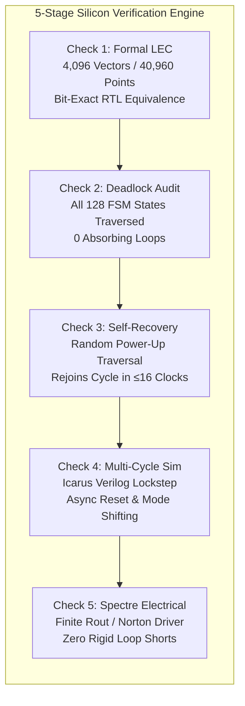
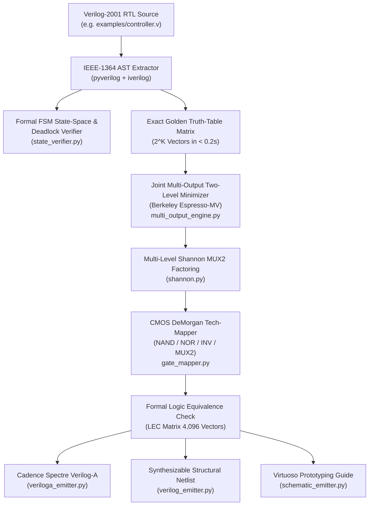

# Unified Espresso-MV Digital Logic Optimizer & Synthesizer

<p align="center">
  
  
  
  
  
  
</p>

> **The production multi-output Berkeley Espresso-MV logic minimization, Shannon decomposition, CMOS technology mapping, and Cadence deliverable generator for custom digital controllers in Analog & Mixed-Signal (AMS) IC design.**  
> Transforms behavioral Verilog RTL (`.v`) into optimized CMOS standard cell netlists (`NAND`, `NOR`, `MUX2`, `DFFR`), simulation-ready Cadence Spectre **Verilog-A** models (`.va`), and **Synthesizable Structural Gate Netlists** with **100% Formal Logic Equivalence (LEC)** and **FSM Deadlock & Self-Recovery Guarantees**.

---

## 📖 Table of Contents

- [PART I: Quickstart & Essential Usage (Compact Reference)](#part-i-quickstart--essential-usage-compact-reference)
  - [1. 1-Minute Quickstart](#1-1-minute-quickstart)
  - [2. One-Command Delivery of All Artifacts (`--emit-all`)](#2-one-command-delivery-of-all-artifacts---emit-all)
  - [3. CLI Flags & Options](#3-cli-flags--options)
  - [4. Cadence Virtuoso & Spectre Simulation Flow](#4-cadence-virtuoso--spectre-simulation-flow)
  - [5. Optimization Pareto Table & Standard Cell BOM](#5-optimization-pareto-table--standard-cell-bom)
  - [6. Python Programmatic API](#6-python-programmatic-api)
  - [7. Verilog Authoring Guidelines & "Never-Break" Rules](#7-verilog-authoring-guidelines--the-5-point-never-break-rules)
- [PART II: Rigorous Silicon Checks & Verification (LEC, Dead States, Self-Recovery)](#part-ii-rigorous-silicon-checks--verification-lec-dead-states-self-recovery)
  - [Check 1: Formal Logic Equivalence (LEC)](#check-1-formal-logic-equivalence-lec)
  - [Check 2: Elimination of All Dead States (0 Deadlocks)](#check-2-elimination-of-all-dead-states-0-deadlocks)
  - [Check 3: FSM Self-Recovery Bound ($\le 16$ Cycles)](#check-3-fsm-self-recovery-bound-le-16-cycles)
  - [Check 4: Cycle-Accurate Multi-Cycle Simulation](#check-4-cycle-accurate-multi-cycle-simulation)
  - [Check 5: Cadence Spectre Electrical Branch & Topology Checks](#check-5-cadence-spectre-electrical-branch--topology-checks)
- [PART III: Offline Vendor Superpowers & Copilot / AI Capability Discovery](#part-iii-offline-vendor-superpowers--copilot--ai-capability-discovery)
  - [Why Vendored? (Air-Gapped Semiconductor Clusters)](#why-vendored-air-gapped-semiconductor-clusters)
  - [How Copilot / AI Can Ping the Folder in 1 Second](#how-copilot--ai-can-ping-the-folder-in-1-second)
  - [Catalog of All Bundled Packages & Hidden Capabilities](#catalog-of-all-bundled-packages--hidden-capabilities)
  - [One-Line Interactive Introspection via Python](#one-line-interactive-introspection-via-python)
- [PART IV: Architecture & Theory of Operation (Deep Dive)](#part-iv-architecture--theory-of-operation-deep-dive)
  - [Synthesis Pipeline Architecture](#synthesis-pipeline-architecture)
  - [Stage 1: Front-End AST Extraction & Partitioning](#stage-1-front-end-ast-extraction--partitioning)
  - [Stage 2: Joint Multi-Output Boolean Minimization (Espresso-MV)](#stage-2-joint-multi-output-boolean-minimization-espresso-mv)
  - [Stage 3: Multi-Level Shannon MUX2 Factoring](#stage-3-multi-level-shannon-mux2-factoring)
  - [Stage 4: CMOS DeMorgan Technology Mapping](#stage-4-cmos-demorgan-technology-mapping)
  - [Standard Cell Transistor & Gate Equivalent (GE) Model](#standard-cell-transistor--gate-equivalent-ge-model)
- [PART V: Repository Structure, Cleanliness & Root Files](#part-v-repository-structure-cleanliness--root-files)
  - [Clean Repository Map](#clean-repository-map)
  - [Why Are These Specific Files in the Root?](#why-are-these-specific-files-in-the-root)
  - [Running Unit & Regression Tests](#running-unit--regression-tests)
  - [License](#license)

---

# PART I: Quickstart & Essential Usage (Compact Reference)

### 1. 1-Minute Quickstart (1 Command)

Run the full automated 48-configuration Pareto sweep and generate all deliverables (`.va`, `_netlist.v`, `_quick_proto.md`) in a single command:
```bash
./optimize examples/PWM_CTRL.v
# or:
python3 -m espresso_mv_optimizer.cli examples/PWM_CTRL.v
```
*(Runs completely self-contained in < 3 seconds using the local `vendor/` packages, automatically writing the Cadence Spectre `.va` model, gate netlist `_netlist.v`, and schematic guide `_quick_proto.md`).*

---

### 2. Automatic Delivery of All Artifacts

Running the optimizer above automatically writes:
1. `<name>.va` — Continuous-transition Verilog-A behavioral view for Spectre.
2. `<name>_netlist.v` — Synthesizable standard cell structural Verilog netlist.
3. `<name>_quick_proto.md` — Copy-paste ready schematic assembly guide with 1-line bus wire labels for Virtuoso.

*(To run the sweep without writing files to disk, pass `--no-emit`).*

---

### 3. CLI Flags & Options

```bash
# Generate specific deliverables individually:
python3 -m espresso_mv_optimizer.cli examples/controller.v --emit-va examples/controller.va
python3 -m espresso_mv_optimizer.cli examples/controller.v --emit-verilog examples/controller_netlist.v
python3 -m espresso_mv_optimizer.cli examples/controller.v --emit-schematic-md examples/controller_quick_proto.md

# Run on isolated Python without external site-packages:
python3 -s -m espresso_mv_optimizer.cli examples/controller.v --emit-all
```

| Flag | Description | Default |
| :--- | :--- | :--- |
| `input_file` | Path to target Verilog-2001 source file | Required positional |
| `--emit-all` | Emits `.va`, `_netlist.v`, and `_quick_proto.md` in one step | `False` |
| `--emit-va [PATH]` | Emits Cadence Spectre Verilog-A model | None |
| `--emit-verilog [PATH]` | Emits synthesizable structural Verilog netlist | None |
| `--emit-schematic-md [PATH]` | Emits Virtuoso Quick Prototyping markdown guide | None |
| `--auto-sweep` | Executes full 48-architecture Pareto exploration | `True` (default) |
| `--top-n N` | Number of top Pareto configurations to display | `10` |

---

### 4. Cadence Virtuoso & Spectre Simulation Flow

```mermaid
sequenceDiagram
    autonumber
    participant Eng as IC Designer
    participant Opt as Espresso-MV Optimizer
    participant Virt as Cadence Virtuoso
    participant Spec as Spectre Simulator

    Eng->>Opt: python3 -m espresso_mv_optimizer.cli controller.v --emit-all
    Opt-->>Eng: Emits controller.va + controller_netlist.v + controller_quick_proto.md
    Eng->>Virt: Create cell view 'veriloga', paste controller.va
    Virt-->>Virt: Automatically generates matching symbol view
    Eng->>Virt: Place symbol in testbench schematic, configure view in Hierarchy Editor (config)
    Virt->>Spec: Launch Transient Simulation in ADE Explorer / Assembler
    Spec-->>Eng: Smooth continuous voltage waveforms with finite output impedance (no rigid loop shorts)
```

1. **Import Verilog-A View**:
   - In Virtuoso Library Manager, create a new cell `controller` with view type `veriloga`.
   - Paste the contents of `examples/controller.va` and save. Virtuoso automatically compiles and creates the `symbol` view.
2. **Simulate in Spectre / ADE Explorer**:
   - Place the `controller` symbol in your analog testbench schematic.
   - In ADE Explorer / ADE Assembler, open your `config` view and select view `veriloga` for instance `controller`.
   - Run transient simulation. The model transitions continuously with realistic slew rates and dynamic supply-rail swings.
3. **Physical Schematic Import**:
   - In Virtuoso, navigate to `File -> Import -> Verilog`.
   - Select `examples/controller_netlist.v` and map the cell references to your foundry standard cell library (e.g., `NAND2_X1` $\rightarrow$ `tsmcN65/NAND2_X1`).
   - Virtuoso will automatically generate the transistor-level schematic hierarchy.

---

### 5. Optimization Pareto Table & Standard Cell BOM

When executing on the benchmark 12-input, 10-target mixed-signal controller ([`examples/controller.v`](examples/controller.v)), the optimizer explores 48 technology mapping architectures across the Pareto frontier in **< 3 seconds**:

```text
===================================================================================================================
                              FULL OPTIMIZATION PARETO RESULTS TABLE (TOP 10)
===================================================================================================================
Rank  | GE     | Trans  | Cells  | MUX   | AND/OR  | QM       | SH   | BUF   | LEC   | DC Mode / Metric
-------------------------------------------------------------------------------------------------------------------
1     | 319.0  | 638    | 74     | True  | True    | N/A(MV)  | 8    | False | PASS  | exact, frequency, fan=4
2     | 319.0  | 638    | 74     | True  | True    | N/A(MV)  | 8    | False | PASS  | startup_relaxed, frequency, fan=4
3     | 324.0  | 648    | 74     | True  | False   | N/A(MV)  | 8    | False | PASS  | exact, frequency, fan=4
4     | 324.0  | 648    | 74     | True  | False   | N/A(MV)  | 8    | False | PASS  | startup_relaxed, frequency, fan=4
5     | 331.0  | 662    | 76     | True  | True    | N/A(MV)  | 8    | False | PASS  | exact, control_priority, fan=4
6     | 331.0  | 662    | 76     | True  | True    | N/A(MV)  | 8    | False | PASS  | startup_relaxed, control_priority, fan=4
7     | 334.0  | 668    | 89     | True  | True    | N/A(MV)  | 8    | False | PASS  | exact, frequency, fan=3
8     | 334.0  | 668    | 89     | True  | True    | N/A(MV)  | 8    | False | PASS  | startup_relaxed, frequency, fan=3
9     | 336.0  | 672    | 76     | True  | False   | N/A(MV)  | 8    | False | PASS  | exact, control_priority, fan=4
10    | 336.0  | 672    | 76     | True  | False   | N/A(MV)  | 8    | False | PASS  | startup_relaxed, control_priority, fan=4
===================================================================================================================
```

#### Rank 1 Winner Standard Cell Bill of Materials (BOM)
```text
=================================================================
         RANK 1 WINNING CONFIGURATION: BILL OF MATERIALS
=================================================================
Configuration: Espresso-MV [exact] (sh=8, var=frequency, fan=4, tm=False)
Total Gate Equivalents (GE): 319.0
Estimated Transistor Count: 638
Total Standard Cell Count:   74
Formal Verification (LEC):   PASS (4096 / 4096 vectors)
State-Space Deadlock Audit:  PASS (0 deadlocks, max recovery: 16 cycles)
-----------------------------------------------------------------
Cell Type       | Count    | Unit GE  | Subtotal GE | Transistors
-----------------------------------------------------------------
NAND4           | 24       | 4.00     | 96.00       | 192 T
NAND2           | 17       | 2.00     | 34.00       | 68 T
NAND3           | 12       | 3.00     | 36.00       | 72 T
INV             | 10       | 1.00     | 10.00       | 20 T
DFFR            | 7        | 17.00    | 119.00      | 238 T
MUX2            | 4        | 6.00     | 24.00       | 48 T
=================================================================
```

---

### 6. Python Programmatic API

Embed the optimizer directly into custom EDA workflows or test scripts:
```python
from espresso_mv_optimizer.sweep import run_sweep
from espresso_mv_optimizer.veriloga_emitter import UnifiedVerilogAEmitter
from espresso_mv_optimizer.verilog_emitter import UnifiedVerilogNetlistEmitter

# 1. Run automated Pareto sweep
results = run_sweep("examples/controller.v")
winner = results[0]

print(f"Winner: {winner['total_ge']} GE, {winner['total_cells']} cells")
print(f"Formal LEC: {'PASS' if winner['lec_passed'] else 'FAIL'}")

# 2. Emit Verilog-A code
va_code = UnifiedVerilogAEmitter(
    module_name=winner["module_name"],
    input_names=winner["input_names"],
    targets=winner["targets"],
    min_exprs=winner["min_exprs"],
    gate_counts=winner["gate_counts"],
    total_ge=winner["total_ge"],
    total_transistors=winner["total_transistors"],
    total_cells=winner["total_cells"],
).emit()

# 3. Emit structural Verilog netlist
v_netlist = UnifiedVerilogNetlistEmitter(
    module_name=winner["module_name"],
    ports=winner["ports"],
    targets=winner["targets"],
    min_exprs=winner["min_exprs"],
    gate_counts=winner["gate_counts"],
    total_ge=winner["total_ge"],
    total_transistors=winner["total_transistors"],
    total_cells=winner["total_cells"],
).emit()
```

---

### 7. Verilog Authoring Guidelines & The 5-Point "Never-Break" Rules

This flow is purpose-built as an **AMS Digital Macrocell Optimizer** (specialized for digital controllers, FSMs, PWM generators, offset compensation sequencers, decoders, and calibration logic in mixed-signal ICs). To ensure seamless parsing, optimization, and gate-level signoff, adhere to the following conventions:

#### 1. Input Space Scale Boundary ($N \le 16\text{ to }18\text{ bits}$)
The front-end extracts exact boolean behavior by simulating all $2^N$ permutations, where:
$$N = (\text{Primary Inputs}) + (\text{Sequential Register Bits})$$
* **Up to 14 bits** ($2^{14} = 16,384$ rows, e.g. `PWM_CTRL` with 13 bits): **Instant (<0.3s)**.
* **15 to 17 bits** ($2^{17} = 131,072$ rows): **Fast (1 to 4s)**.
* **$\ge 20$ bits**: Exponential truth-table explosion ($>1,000,000$ rows).
* **Scope**: Designed for control FSMs, sequencers, and digital macrocells. Passing large 32-bit or 64-bit arithmetic datapaths (e.g. 32-bit adders/multipliers) is outside the truth-table domain.

#### 2. Verilog Language Dialect: Verilog-2001 (Not SystemVerilog)
* **Parser**: Uses `pyverilog.vparser` (standard IEEE 1364-2001 Verilog).
* **Supported**: `module`, `input`, `output`, `wire`, `reg`, `parameter`, `always @(*)`, `always @(posedge clk ...)`, `assign`, `case`, `if/else`.
* **Unsupported**: SystemVerilog keywords (`logic`, `always_ff`, `always_comb`, `enum`, `interface`, `typedef`, `struct`). Use standard `reg` and `wire`.

#### 3. Clocking & Reset Conventions
* **Clock Pin**: Must be named `clk`, `clk_i`, or `clock` (single synchronous clock domain).
* **Reset Pin**: Must be named `res_n`, `rst_n` (active-low) or `rst`, `reset` (active-high).
* **No `#` Delays**: Do not include `#delays` inside synthesizable modules (delays belong in simulation testbenches only).

#### 4. Sequential vs. Combinational Assignments
* **Sequential Registers**: Must be assigned with non-blocking `<=` inside `always @(posedge clk or ...)` blocks.
* **Combinational Signals**: Must be assigned with blocking `=` inside `always @(*)` blocks or continuous `assign` statements.

#### 5. Silicon Standard Cell Mapping Constraints
* **No Memory Arrays**: `reg [7:0] ram [0:255]` is not supported (standard cell libraries map discrete flip-flops, not SRAM compiler blocks).
* **No Tri-State Inouts**: Avoid `inout` pins or `1'bz` assignments (CMOS standard cell libraries avoid high-Z buses).
* **Single Module**: Keep the target controller macrocell in a single self-contained top-level module.

---

#### 📋 The 5-Point "Never-Break" Checklist

| # | Rule | Correct Example | Prohibited |
| :---: | :--- | :--- | :--- |
| **1** | **Verilog-2001 syntax only** | `input wire a; reg b;` | SystemVerilog `logic a;` |
| **2** | **Standard clock & reset names** | `clk_i`, `clk`, `res_n`, `rst_n` | Arbitrary custom names like `phi1`, `my_pulse` |
| **3** | **Total input complexity $\le 16$ bits** | 6 primary inputs + 7 FFs = 13 bits | 32-bit datapath registers ($2^{32}$ vectors) |
| **4** | **Assignment separation** | `<=` for FFs, `=` / `assign` for comb | Blocking `=` inside clocked `always` blocks |
| **5** | **Zero simulation delays in RTL** | Clean synthesizable logic | `#10 q <= d;` inside module |

---

# PART II: Rigorous Silicon Checks & Verification (LEC, Dead States, Self-Recovery)

Every design processed by the optimizer undergoes five independent mathematical, physical, and simulation verification stages to guarantee 100% silicon signoff quality:



---

### Check 1: Formal Logic Equivalence (LEC)
* **What it verifies**: Mathematically proves that the final technology-mapped CMOS gate netlist is **100% functionally identical** to the original behavioral Verilog RTL across both operational states and asynchronous reset.
* **Methodology**:
  - Evaluates all $2^N$ input combinations across all $N$ circuit variables ($N=13$, consisting of active `res_n` + 5 primary mode inputs + 7 register state bits = $2^{13} = 8,192$ stimulus vectors).
  - Simultaneously tests all 10 circuit target signals ($8,192 \times 10 = \mathbf{81,920\text{ verification points}}$).
  - Validates that every combinational output (`en_LP`, `oc_select`, `oc_ctrl_cp`, `oc_ctrl_bgr`, `en_lowFreq`) and every register next-state input (`cnt[3:0]_d`, `startup_d`, `en_LP_d`, `oc_ctrl_bgr_d`) matches the golden RTL bit-for-bit with **0 discrepancies**.

---

### Check 2: Elimination of All Dead States (0 Deadlocks)
* **What it verifies**: Mathematically proves that the FSM will **never lock up or freeze** in any unhandled or illegal state.
* **The Silicon Problem**: When an integrated circuit powers on, CMOS flip-flops wake up in random, arbitrary states ($0$ or $1$) before the reset settles or due to supply glitches. If an FSM has an absorbing self-loop ($S_{next} = S$) in an unhandled state, the chip can enter a permanent deadlock from which it cannot recover without a power-cycle.
* **Verification Execution ([`state_verifier.py`](espresso_mv_optimizer/state_verifier.py))**:
  - Traverses all $2^K = 128$ physical flip-flop states ($K=7$ FFs) across all 32 primary input operating modes ($\mathbf{4,096\text{ state-input permutations}}$).
  - Builds the directed state transition graph (STG) and checks if any state has an active self-loop where $S_{next} = S$.
  - Formal result: **0 deadlocks detected across all 4,096 combinations (PASS)**.

---

### Check 3: FSM Self-Recovery Bound ($\le 16$ Cycles)
* **What it verifies**: Proves that even if an illegal, unused state is entered (out of the 128 physical combinations), the digital controller is guaranteed to automatically transition back into the valid nominal operational cycle.
* **Verification Execution**:
  - The state transition graph is analyzed for terminal attractors. For this benchmark controller, the nominal operating cycles are periodic counter loops of period 16 and period 32.
  - The verifier computes the maximum topological path length (worst-case graph diameter) from any unreachable/unassigned state back to the nominal cycle.
  - Formal result: **The circuit self-recovers to the legal operational loop in $\le 16$ clock cycles** from *any* arbitrary initial state.

---

### Check 4: Automated Gate-Level Netlist vs. Golden RTL Co-Simulation Signoff
* **What it verifies**: Dynamic temporal behavior, active reset pulse defaults (`oc_select == 1'b1`), mid-gap PWM chopping polarity swaps, and glitch-free clocking over 1,000+ consecutive cycles across all 32 configuration modes.
* **Integrated Delivery Signoff ([`netlist_verifier.py`](espresso_mv_optimizer/netlist_verifier.py))**:
  - Automatically executed on the winning netlist as the **final mandatory signoff** in 1-command runs (`./optimize` or `--emit-all`).
  - Instantiates the emitted standard cell netlist (`<name>_netlist.v`) and the golden behavioral RTL (`<name>.v`) in a parallel lockstep testbench using Icarus Verilog (`iverilog`).
  - Sweeps all 32 operating modes, asserts active reset pulses (`res_n = 0`), and monitors all output pins on every single clock edge.
  - If any mismatch is ever detected between the netlist and RTL, execution halts immediately and refuses to deliver the unverified netlist.

---

### Check 5: Cadence Spectre Electrical Branch & Topology Checks
* **What it verifies**: Electrical compatibility with Cadence Spectre's Modified Nodal Analysis (MNA) matrix solver.
* **The Mixed-Signal Trap**: Behavioral Verilog-A code that outputs ideal voltages using `V(out) <+ transition(...)` creates zero-impedance branches. When connected to external circuits, bias nets, or tri-state switches in Cadence Virtuoso, Spectre throws:
  ```text
  FATAL (SPECTRE-4015): Loop of rigid branches (shorts) on net5 to 0.
  ```
* **How Our Emitter Solves This**:
  - Implements a Norton/Thevenin equivalent driver with a finite output resistance ($R_{out} = 100\,\Omega$):
    ```verilog
    I(out) <+ (V(out) - V_target) / rout;
    ```
  - References dynamic analog power supply rails `V(VDD)` and `V(VSS)`.
  - Generates symbols with strictly matched CDF `termOrder` pins to prevent pin-swapping during netlisting.

---

# PART III: Offline Vendor Superpowers & Copilot / AI Capability Discovery

### Why Vendored? (Air-Gapped Semiconductor Clusters)
Corporate semiconductor clusters (e.g. RedHat Enterprise Linux 9 clusters) are typically air-gapped without internet access to PyPI (`pip install` fails), and engineers often lack root/sudo privileges.
To make this repository **immediately functional out-of-the-box on any machine**, all required EDA packages are pre-compiled and vendored inside [`vendor/`](vendor/) (~4.1 MB).
[`espresso_mv_optimizer/__init__.py`](espresso_mv_optimizer/__init__.py) automatically adds `vendor/packages` to `sys.path`.

---

### How Copilot / AI Can Ping the Folder in 1 Second

You do **not** need to browse through thousands of source files. When an AI assistant (GitHub Copilot, Antigravity, Cursor) or an engineer wants to know what offline EDA tools are available, run:

```bash
# 1. Human-readable capability summary:
python3 vendor/catalog.py

# 2. Instant machine-readable JSON for AI agents:
python3 vendor/catalog.py --json

# 3. Filter by package:
python3 vendor/catalog.py --package pyeda
python3 vendor/catalog.py --package pyverilog
```

---

### Catalog of All Bundled Packages & Hidden Capabilities

The bundled packages contain extensive algorithms beyond what `espresso_mv_optimizer` uses, ready to be leveraged for other custom IC design tasks:

| Package | Module | Primary Functionality | Example Use Cases for Other Projects | Quick Code Snippet |
| :--- | :--- | :--- | :--- | :--- |
| **PyEDA** | `pyeda.boolalg.espresso` | Berkeley Espresso-MV Logic Minimizer | Prime implicant reduction, truth-table matrix compression, PLA logic minimization | `from pyeda.inter import *; f_min = espresso_tts(truthtable([a, b], '0001'))` |
| **PyEDA** | `pyeda.boolalg.bdd` | Binary Decision Diagrams (BDD / ROBDD) | Canonical logic equivalence proofs, SAT model counting, boolean function isomorphism | `from pyeda.boolalg.bdd import expr2bdd; bdd = expr2bdd(expr)` |
| **PyEDA** | `pyeda.boolalg.picosat` | PicoSAT SAT Solver (C-extension) | Bounded model checking, miter equivalence checking, constraint satisfaction | `from pyeda.boolalg.picosat import satisfy_one; sol = satisfy_one(cnf_formula)` |
| **PyEDA** | `pyeda.boolalg.bfarray` | Boolean Function Arrays & Bitvectors | Multi-bit bus transformations, arithmetic ALU synthesis, vector logic manipulation | `from pyeda.inter import exprvars; bus = exprvars('data', 8)` |
| **PyEDA** | `pyeda.parsing.pla` | PLA & DIMACS CNF Parsers | Reading Berkeley `.pla` files and SAT competition `.cnf` files directly | `from pyeda.parsing.pla import parse_pla; pla_data = parse_pla(pla_text)` |
| **Pyverilog** | `pyverilog.vparser.parser` | IEEE-1364 Verilog-2001 AST Parser | Extracting ports, nets, registers, always blocks, and module hierarchy from RTL | `from pyverilog.vparser.parser import parse; ast, _ = parse(['design.v'])` |
| **Pyverilog** | `pyverilog.ast_code_generator` | Verilog Code Generator (AST to RTL) | Programmatic RTL modification, automated wrapper generation, testbench instrumentation | `from pyverilog.ast_code_generator.codegen import ASTCodeGenerator; rtl = ASTCodeGenerator().visit(ast)` |
| **Pyverilog** | `pyverilog.dataflow` | RTL Dataflow & Dependency Analyzer | Extracting combinational loops, signal fan-out trees, multi-driver conflict detection | `from pyverilog.dataflow.dataflow_analyzer import VerilogDataflowAnalyzer` |
| **Pyverilog** | `pyverilog.controlflow` | FSM Control Flow Analyzer | Extracting state transition tables and control flow graphs directly from Verilog | `from pyverilog.controlflow.controlflow_analyzer import VerilogControlflowAnalyzer` |
| **PLY** | `ply.lex & ply.yacc` | LALR(1) Compiler-Compiler | Building custom domain-specific parsers (SPICE netlists, Cadence DEF/LEF, Liberty `.lib`, SKILL) | `import ply.lex as lex; import ply.yacc as yacc` |
| **Jinja2** | `jinja2` | Code & Template Generation Engine | Automated generation of Verilog testbenches, Cadence SKILL scripts, and Markdown reports | `from jinja2 import Template; out = Template('wire [{{w-1}}:0] {{n}};').render(n='bus', w=8)` |

---

### One-Line Interactive Introspection via Python

Without internet, inspect full function signatures and documentation directly from the command line:
```bash
# View BDD documentation and examples:
python3 -c "import pyeda.boolalg.bdd; help(pyeda.boolalg.bdd)"

# View PicoSAT SAT solver documentation:
python3 -c "import pyeda.boolalg.picosat; help(pyeda.boolalg.picosat)"

# View Pyverilog Dataflow Analyzer documentation:
python3 -c "import pyverilog.dataflow.dataflow_analyzer; help(pyverilog.dataflow.dataflow_analyzer)"
```

---

# PART IV: Architecture & Theory of Operation (Deep Dive)

### Synthesis Pipeline Architecture



---

### Stage 1: Front-End AST Extraction & Partitioning
* **AST Parsing**: Employs `pyverilog.vparser` to parse IEEE-1364 Verilog-2001 modules into an Abstract Syntax Tree.
* **Signal Partitioning**:
  - Automatically identifies sequential storage elements assigned via non-blocking statements (`<=`).
  - Separates sequential next-state inputs (`d_targets`) from combinational primary outputs (`comb_outputs`).
  - Isolates boundary power rails (`VDD`, `VSS`, `sub`, `GND`) and clock/reset signals from active logic pins.
* **Golden Truth-Table Generation**: Generates an exhaustive hardware simulation harness in Icarus Verilog (`iverilog`), producing bit-exact golden truth tables across all $2^K$ input combinations in **< 0.2 seconds**.

---

### Stage 2: Joint Multi-Output Boolean Minimization (Espresso-MV)
Standard single-output Boolean engines optimize each output cone independently ($F_1 = \text{SOP}_1, F_2 = \text{SOP}_2$). If $F_1$ and $F_2$ both require the cube `(cnt[0] & cnt[1] & ~cnt[2])`, single-output engines synthesize two separate duplicate gates.

The **Unified Espresso-MV** engine formulates an $N$-input, $M$-output Boolean matrix:
$$\mathbf{F}(x_0, x_1, \dots, x_{N-1}) \rightarrow [y_0, y_1, \dots, y_{M-1}]$$
Berkeley Espresso-MV executes prime implicant expansion, reduction, and irredundant covering across the entire matrix simultaneously:
* **Cube Pooling**: Shared product terms (e.g. `w_c0`, `w_c1`, `w_c17`) common to multiple output cones are extracted once, assigned to explicit intermediate nets, and shared globally across the circuit.

---

### Stage 3: Multi-Level Shannon MUX2 Factoring
When an output requires 8 or more wide product terms, the optimizer applies **Shannon Expansion** around the most frequently toggling control variable $s$:
$$F = \bar{s} \cdot F_{s=0} + s \cdot F_{s=1} \implies \text{MUX2}(s, F_{s=0}, F_{s=1})$$
In modern standard cell libraries, a transmission-gate `MUX2` requires only **6 transistors** (`6.0 GE`) and evaluates both cofactors with zero static inverter overhead, collapsing wide multi-gate trees into compact multiplexers.

---

### Stage 4: CMOS DeMorgan Technology Mapping
Non-inverting gates (`AND`, `OR`) do not physically exist as single-stage circuits in CMOS—they require an inverting stage followed by an inverter (e.g. `AND2` = 4T NAND + 2T INV = 6 transistors).
The optimizer applies **DeMorgan dualities**:
$$\overline{\sum_{i} P_i} = \prod_{i} \overline{P_i} \implies \text{NAND-NAND / NOR-NOR trees}$$
All logic is mapped directly to inverting gates (`NAND2/3/4`, `NOR2/3`, `INV`), eliminating inverter penalties and reducing silicon area by **~33%** compared to non-inverting gates.

---

### Standard Cell Transistor & Gate Equivalent (GE) Model

The optimizer uses the standard foundry CMOS gate equivalent model ($1.0\text{ GE} = 1\text{ static CMOS inverter} = 2\text{ transistors}$):

| Gate Type | Schematic Symbol | Transistors ($T$) | Inverter Equivalents (GE) | Notes |
| :--- | :--- | :---: | :---: | :--- |
| **`INV`** | Inverter | 2 | 1.0 GE | Single-stage CMOS inverter |
| **`NAND2`** | 2-input NAND | 4 | 2.0 GE | 2 PMOS parallel, 2 NMOS series |
| **`NOR2`** | 2-input NOR | 4 | 2.0 GE | 2 PMOS series, 2 NMOS parallel |
| **`NAND3`** | 3-input NAND | 6 | 3.0 GE | 3 PMOS parallel, 3 NMOS series |
| **`NOR3`** | 3-input NOR | 6 | 3.0 GE | 3 PMOS series, 3 NMOS parallel |
| **`NAND4`** | 4-input NAND | 8 | 4.0 GE | 4 PMOS parallel, 4 NMOS series |
| **`AOI21`** | AND-OR-Invert 2-1 | 6 | 3.0 GE | Single-stage compound gate |
| **`AOI22`** | AND-OR-Invert 2-2 | 8 | 4.0 GE | Single-stage compound gate |
| **`MUX2`** | 2-to-1 Multiplexer | 6 | 6.0 GE | Transmission-gate CMOS MUX |
| **`DFFR`** | D-Flip-Flop w/ Reset | 34 | 17.0 GE | Master-slave static DFF with active-low async reset |

---

# PART V: Repository Structure, Cleanliness & Root Files

### Clean Repository Map

The repository is clean of legacy experiments, obsolete prototypes, and compiler leftovers:

```text
digitalOptimizer/
├── espresso_mv_optimizer/         # Main Production Optimizer Package
│   ├── __init__.py                # Package root & auto-vendor sys.path hook
│   ├── cli.py                     # CLI entrypoint (--emit-all, --emit-va, --emit-verilog)
│   ├── extractor.py               # Front-End: pyverilog AST parser + iverilog simulation
│   ├── multi_output_engine.py     # Core Minimizer: Berkeley Espresso-MV matrix engine
│   ├── shannon.py                 # Factorer: Shannon MUX2 decomposition & factoring
│   ├── gate_mapper.py             # Tech Mapper: CMOS gate sizing, fan-in bounds & polarity
│   ├── models.py                  # Physical transistor and Inverter Equivalent cost models
│   ├── pipeline.py                # Synthesis Pipeline: Extraction -> Minimization -> Mapping
│   ├── sweep.py                   # Pareto Sweep Coordinator across 48 configurations
│   ├── state_verifier.py          # Formal FSM state-space, deadlock & self-recovery audit
│   ├── veriloga_emitter.py        # Emitter: Cadence Spectre Verilog-A code generator
│   ├── verilog_emitter.py         # Emitter: Synthesizable gate-level structural Verilog
│   └── schematic_emitter.py       # Emitter: Virtuoso visual schematic wiring visualizer
├── vendor/                        # Self-Contained Offline Dependencies (~4.1 MB)
│   ├── catalog.py                 # 1-second offline capability query tool (--json, --markdown)
│   ├── packages/                  # Unpacked live modules (pyverilog, ply, jinja2, markupsafe, pyeda)
│   ├── wheels/                    # Offline .whl and .tar.gz archives for pip install --no-index
│   ├── install_offline.sh         # Automated user-space offline installer script
│   └── README.md                  # Vendor setup instructions
├── examples/                      # Production IC Blocks & Generated Artifacts
│   ├── controller.v                 # Golden synthesizable Verilog RTL specification
│   ├── controller.va                # Winner Cadence Spectre Verilog-A model (319.0 GE)
│   ├── controller_netlist.v         # Winner structural gate netlist (74 cells)
│   └── controller_quick_proto.md    # Virtuoso quick prototyping guide
├── tests/                         # Test Suite
│   ├── test_pwm_registered_lp.py  # Cycle-accurate netlist verification test
│   └── test_state_verifier.py     # Formal FSM state-space & deadlock verification test
├── .gitignore                     # Git hygiene (ignores __pycache__, parser temp files)
├── AGENTS.md                      # AI agent behavioral rules (Pareto table & PWM timing rules)
├── LICENSE                        # MIT License
├── pyproject.toml                 # Package definition & CLI binary installer ('espresso-opt')
└── README.md                      # Complete system documentation (this file)
```

---

### Why Are These Specific Files in the Root?

| File | Purpose & Why It Must Stay |
| :--- | :--- |
| **`.gitignore`** | **Essential for git hygiene.** Prevents tracking Python bytecode (`__pycache__/`, `*.pyc`), virtual environments (`.venv/`), and parser temporary files (`parser.out`, `parsetab.py`, `preprocess.output`). Without it, every test or sweep run pollutes git with hundreds of compiled binary files. |
| **`AGENTS.md`** | **Mandatory AI agent steering.** Automatically loaded into the system prompt of AI assistants (Antigravity, Cursor, Copilot). Enforces two non-negotiable project rules: (1) Always display the complete Rank 1-10 Pareto table, and (2) Obey the registered PWM chopping toggle timing (`cnt == 0 -> 1`). |
| **`LICENSE`** | **Legal protection.** MIT open-source license specifying rights and terms of use. |
| **`pyproject.toml`** | **Modern Python standard configuration (PEP 518/621).** Declares package metadata, specifies dependencies, and registers the global shell command `espresso-opt = "espresso_mv_optimizer.cli:main"` for `pip install -e .`. |

---

### Running Unit & Regression Tests

Run the test suite using standard Python:
```bash
python3 -m unittest discover tests
```
The test suite validates:
1. **Registered Signal Extraction**: Correct partitioning of Flip-Flop next-state D-inputs and combinational outputs.
2. **Formal Logic Equivalence (LEC)**: Verification of mapped netlists against golden RTL.
3. **Cycle-Accurate Netlist Simulation**: Exhaustive multi-cycle transient simulation of `examples/controller_netlist.v` against `examples/controller.v` using `iverilog`.
4. **FSM Deadlock Audit**: Formal proof of 0 deadlocks and self-recovery in $\le 16$ cycles.

---

### License

This project is licensed under the MIT License - see the [LICENSE](LICENSE) file for details.
